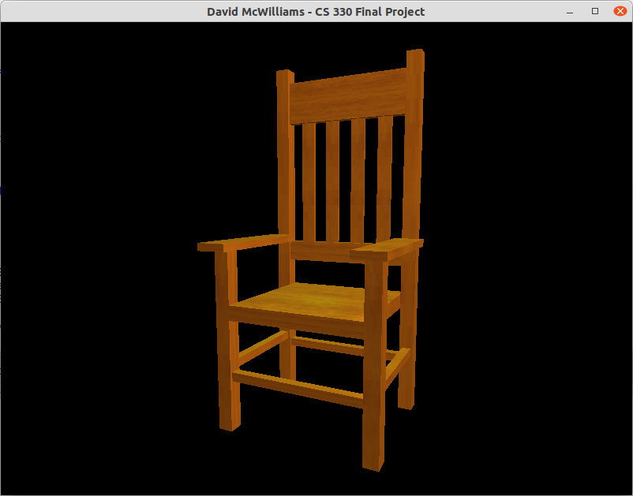

## Development Choices ##
I built a wooden chair for my project. The use of wooden planks allowed me to simplify the design by keeping all polygons aligned to one of the three planes.
The chair has left-right symmetry, which means I only needed to design half of it. Then I drew two copies reflected along the x axis.

## Navigation ## 
Horizontal navigation: Left mouse button click and drag left/right.
Vertical nagivation: Left mouse button click and drag up/down.
Zoom: Mouse scroll wheel up/down.
Perspective display: P key.
Orthographic display: O key.

The virtual camera has two user controlled components: cameraDirection and zoomScale. These are multiplied together to create an eye vector, which is then transformed to a view matrix using the glm::lookAt() function.

I used glutMotionFunc() to detect mouse click-and-drag inputs to orbit the object. I used glutMouseFunc() to detect mouse wheel input for zooming. I also used glutMouseFunc() to detect when the left mouse button was pressed, to enable and disable horizontal and vertical nagivation. I used glutKeyboardFunc() to detect key presses and switch between perspective and orthographic display.

## Custom Functions ##
I manually plotted the 50 rectangles in the object. Then I wrote a custom function called PlanarRectangleToTriangles() to convert a rectangle into two triangles, and calculate textures and normals. This automatically generated the 2400 vertices that I stored in the vertex buffer. I added an axis parameter to the function, which allowed me to reuse it for rectangles in 3 different planes.

I wrote an OpenGL phong() function to calculate the phong components for each lamp. This allowed me to reuse the standard calculations, without needing to worry about whether they were entered correctly each time.
