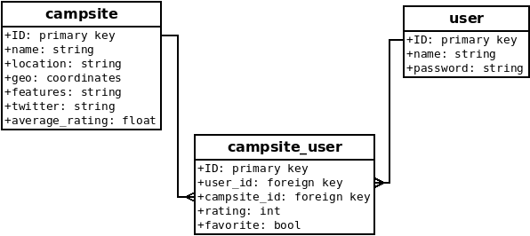


## Databases Enhancement ##

I enhanced the database by porting it from a local SQLite database to a remote MongoDB database. I started by creating a UML model of the database, to ensure I captured all the storage requirements. This demonstrates my ability to convey ideas through visual communication.

Then I used my Python RESTful API from CS-340 as a template to implement each database operation. For example, "create campsite" and "search campsite name". I implemented 14 operations in total, which you can view in the [source code here](https://github.com/DaveMcW/davemcw.github.io/blob/master/Database%20Server/database.py). This demonstrates my ability to create industry-standard software designs.

MongoDB requires indexes to be created to make searching more efficient. I created indexes on user_name, campsite_name, and both foreign keys in the campsite_user collection. Campsite_name is a full-text index, which means it can efficiently deliver search results even if the search query is not a perfect match. You can view the indexes in the [database install file](https://github.com/DaveMcW/davemcw.github.io/blob/master/Database%20Server/create_database.js). This demonstrates my ability to use well-founded techniques and tools in computing practices.

Most database operations require a valid user account. I implemented authentication security using the HTTP Authorization header. The API user is required to post their username and password to the /login endoint, and the server returns a secret token. Then the user passes the token in the HTTP Authorization header when performing secure operations. If a valid token is not detected, the server replies with a 403 Forbidden error. You can view the authorization check in the function [check_login()](https://github.com/DaveMcW/davemcw.github.io/blob/master/Database%20Server/database.py#L25). This demonstrates my ability use best practices in developing a security mindset.

This was my first time working with a secure MongoDB database, so I learned how to set up user permissions and grant the least privileges needed. I also learned the best practices to connect to a secure MongoDB database, using the connection string URI (MongoDB, n.d.).

A challenge I faced was that MongoDB does not support multiple fulltext indexes on a collection. My solution was to use the fulltext index on the most important search field, name. The location and features searches use slower regular expression search.

### Reference ###

MongoDB. (n.d.). Connection String URI Format. Retrieved from https://docs.mongodb.com/manual/reference/connection-string/

Continue to [Algorithms and Data Structures Enhancement](/algorithms_and_data_structures.html).
