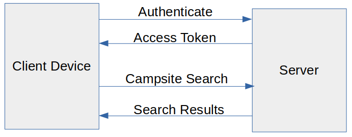
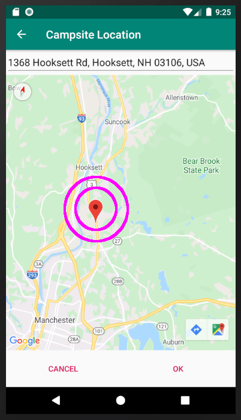


## Software Design and Engineering Enhancement ##

The artifact began as my final project for CS-360. It is a standalone Android app, with a local database of campsites and tools to search, edit, and display campsites on a map. It also included user accounts with personal preferences and authentication.

I enhanced the artifact by moving the database to a remote server. This allows users to collaborate to build an up-to-date, shared database of campsites. Database queries are done using a RESTful API to communicate between the app and the server. Authenticated user accounts are still required to access the server.

I had already set up the remote database in the [Database Enhancement](databases.html). So the main software design and engineering challenge is how to communicate with the remote database. I decided on the Volley library. Volley is a HTTP library that makes networking for Android apps easier and most importantly, faster (Google Developers, n.d.). Here is a [code example](https://github.com/DaveMcW/davemcw.github.io/blob/master/Android App/app/src/main/java/com/cs360/campsitelocator/CampsiteListActivity.java#L121) of one of my remote API calls using Volley. This demonstrates my ability to create industry-standard software designs.

The next challenge was dealing with failed API calls. For most of failures, the app simply displays an error message and does nothing. However, an "403 Forbidden" failure is special, since it means the user must log in again. My solution was to write a [custom ConnectionErrorHandler class](https://github.com/DaveMcW/davemcw.github.io/blob/master/Android App/app/src/main/java/com/cs360/campsitelocator/ConnectionErrorHandler.java#L48), which clears the user's login data and returns them to the main menu, no matter where in the app they currently are.

To help the user, I also included the ability to remember their name and password, and enter it on the main menu. But while testing, I ran into an infinite loop when a wrong password was submitted! The wrong password was saved, then the app returned to the main menu, then the wrong password was resubmitted, then the app returned to the main menu, etc. I solved this by writing a [second ConnectionErrorHandler class](https://github.com/DaveMcW/davemcw.github.io/blob/master/Android App/app/src/main/java/com/cs360/campsitelocator/ConnectionErrorHandler.java#L17) that did not return to the main menu, and using this class for login operations. This demonstrates my ability to employ iterative testing techniques in the code.

Finally, the Google Maps API used in the app could only accept a text location as input, and only produce a map marker as output. I improved this by allowing the user to click the map or type an address to set the location. Once a valid location was entered, the other input (text or map marker) was updated to be consistent. You can view the source code of the [moveMarkerToPoint() function here](https://github.com/DaveMcW/davemcw.github.io/blob/master/Android App/app/src/main/java/com/cs360/campsitelocator/MapsActivity.java#L149). This demonstrates my ability to create more robust code to deliver value.

The final Android app package is available here: [campsite-locator.apk](https://github.com/DaveMcW/davemcw.github.io/releases/download/1.0/campsite-locator.apk)

#### Reflection ####

Despite spending two 8-week semesters working on this Android app, there are many features that I have not had time to implement. For example, images are still stored locally instead of in the remote database. There is very little automated testing. I estimate that adding full test coverage would double the time it took me to build the app. This helps me appreciate the large scope of a mobile application project.

I am proud to have delivered a functioning a mobile app integrated with a remote database, within my 8 week course deadline. This demonstrates my ability to deliver value to stakeholders, in the context of Agile development.

#### Reference ####

Google Developers. (n.d.). Volley overview. Retrieved from https://developer.android.com/training/volley

Return to [Professional Self-Assessment](/).
